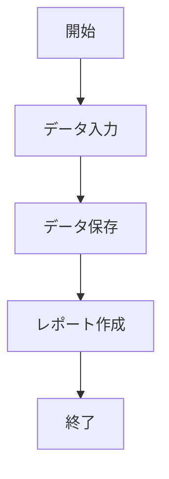

# ツール設計書

## 1. 概要

- **ツール名**:
- **作成者**:
- **作成日**:
- **概要**: ツールの目的や概要を簡単に記載。

## 2. 使用環境

- **使用ソフトウェア**: Microsoft Access
- **バージョン**: Access 20XX
- **依存関係**: 使用する外部ツールやライブラリ、他のファイルなど。

## 3. 機能一覧

| 機能番号 | 機能名             | 概要                                       |
| -------- | ------------------ | ------------------------------------------ |
| 1        | データ入力         | データを入力するフォームの機能について     |
| 2        | レポート作成       | 入力されたデータからレポートを生成する機能 |
| 3        | データの検索・編集 | 既存のデータを検索および編集する機能       |

## 4. 画面設計

- **画面名**:
  - **概要**:
  - **レイアウト**: 簡単な画面のレイアウト図や説明（テキストで簡単に記述）
  - **操作手順**: 画面上での操作手順や注意点

## 5. 処理フロー

